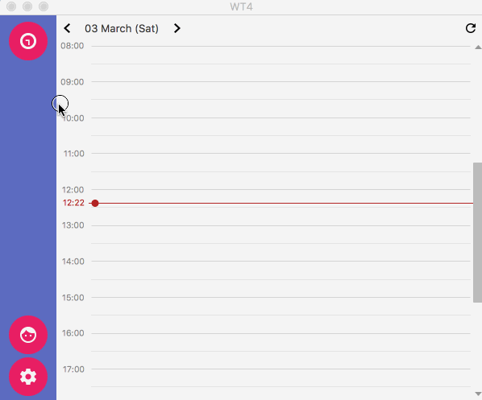
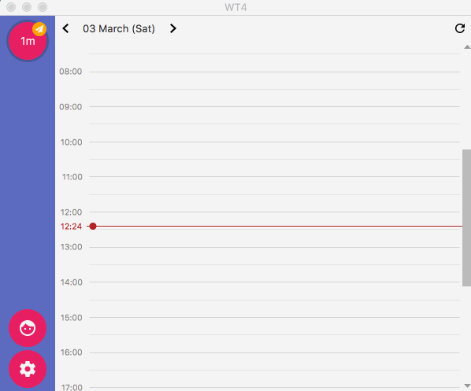
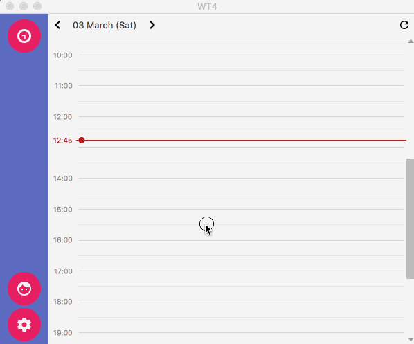
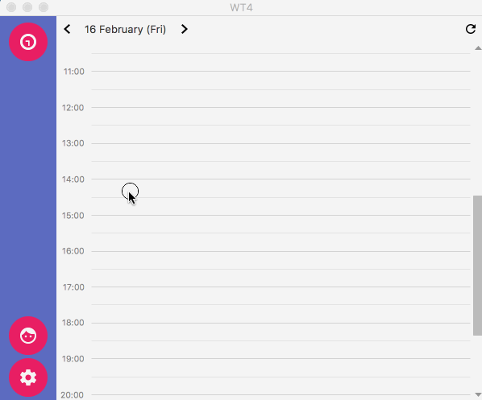
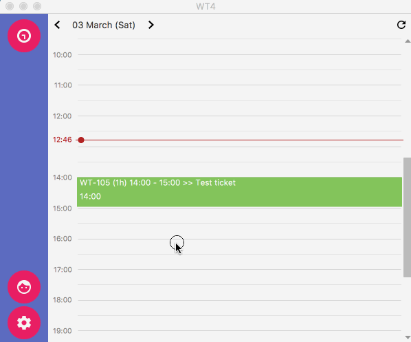

# WT4

Work tracker for JIRA

Sandbox app for tracking work on JIRA

* Single purpose to track time for work
* Works offline
* Synchronizes logs back to JIRA tickets
* Cool calendar type view
* Day / week view
* Edit mode for quickly edit logs
* Profiles for multiple JIRA accounts
* Every major platform

## Download

* MacOSX: 
  - [DMG](http://738649.s.dedikuoti.lt/public/wt4/WT4_mac.dmg)
* Windows:
	  - No more windows package :(
* Linux:
  - [Deb package](http://738649.s.dedikuoti.lt/public/wt4/wt4-4.0.deb)
  
* Linux troubleshooting:
  - Cannot install dpkg. Paste in terminal: `sudo dpkg -i wt4-4.0.deb`. Will install the app to `/opt/WT4`. After it should work properly.
  - To uninstall: Paste in terminal: `sudo dpkg -r wt4`.
 
App will automatically update to newest version

## Features

- Time tracking is as simple as pushin a button
- Whenever logged something, edit any way you want, as far as ticket is not in sync with JIRA (still pending feature)

- Even more editing options for easier management
- Drag and drop ticket (in edit mode)
- Expand / subtract ticket

- To sync tickets with JIRA, check if the user authenticated first!

- Multiple ways to track your work
  - Week view
  - Day view
  - List

- Use profiles to switch users when you're using more than one JIRA (like working at home, and at work)

- If you were using old style and feel a bit retro it is still supported (tho' will be dropped soon)

## Issues

Track issues / feature requests [here](https://github.com/marius-m/wt4/issues)

## Attributions

This app serves me as a sandbox for trying out various java stuff that I find interesting. 
As a side effect app was born that is being used for easier time tracking. 
Feel free copying / contributing / using code for your own pleasure. 

Tricks that were being tackled in this project: 

* [CalendarFX](https://github.com/dlemmermann/CalendarFX) - Most amazing calendar that lets display logs and modify them. Very very cool.  
* [JFoenix](http://www.jfoenix.com/) - Material designs for JavaFX! Amazing!
* [Kotlin](https://kotlinlang.org/) - Most of the app is converted to kotlin, once got used to it, never want to look back. 
* [RXJava](https://github.com/ReactiveX/RxJava) Very cool programming [paradigm](http://reactivex.io/)
* [Dagger2](https://github.com/google/dagger) - Essential for making object graph. Loved it every bit.
* [Getdown](https://github.com/threerings/getdown) - Automatic updater for java. The one that really bahaved as intended, love it so much. 
* [JavaFX-Gradle-Plugin](https://github.com/FibreFoX/javafx-gradle-plugin) - A bit more advanced version of java bundling for platforms.
* [JavaFX](http://docs.oracle.com/javase/8/javase-clienttechnologies.htm) - Great components and quite easy to assemble with after burner.
* [Afterburner](https://github.com/AdamBien/afterburner.fx) - When got into it, cant imagine JavaFx without it.
* [Google material design](https://design.google.com/icons/) - Icons for easier use and clear purpose!
* [JFXTras](https://github.com/JFXtras/jfxtras) - neat components for easier use
  - Agenda view
* [FXExperiende](http://fxexperience.com/) - Advanced components for the jfx
  - Auto completion text view
* [Java8](http://www.oracle.com/technetwork/java/javase/overview/java8-2100321.html)

## FAQ

* Q: Why does it weight so much ?
* A: It is bundled with Java8, so for most part its java that weights so much. It is done, so you don't have to download it separately. 
* Q: I have problems synchronizing with the remote server!
* A: Try checking settings window, as most of the stuff that is done in the background are printed out. That might give you an idea when might not be working.

## Changelog

### 1.0.9
- Bugfix when JIRA ticket code has numbers (for ex.: T2EE-123)

### 1.0.5 - 1.0.7
- Cool calendar view
- Quick day / week change view
- Profiles (multiple JIRA account support)

### 1.0.4
- Authentication settings 
 - Simple checkup test
 - Debug window with full logs
- Quick +/- buttons on time change

### 1.0.3
- Added graphs
 - Fixed bugs with graphs (tho' still not as useful or working 100%)
- Added simplified simple table for viewing logs
 - Smaller info on simple view
- Added status for various logs on week/day view of the calendar
- Add insert custom log option
- Add copy issue to clipboard
 - Snackbar indicates of copied issue

### 1.0.0
- Redesigned window to a more simple version in material design!
- Most of the functionality is already moved, though still missing some parts

### 0.9.9.8-EAP
- Update how enter button scales when resizing the window
- Proper size for search result when looking for an issue
- Smarter query for searching issues
- Open issues from search bar to external browser
- Provide parent info if issue is a subtask

### 0.9.9.7
- Configuration sets (can be found in setting, will update documentation how to use)
 - Add configurations to change instance to more than one JIRA
- Graphs (Graph representation on worked issues. Can be opened by pressing on 'Total worked time button')
- Move enter button to top bar for cleaner interface

### 0.9.9.6
- Change remote auto updates url

### 0.9.9.5
- Improved issue search (should work properly now)
- Added issue search in update

### 0.9.9.4
* Refactored all synchronization with remote
* Rewritten most of the core functionality 
  - GA tracking
  - Auto syncrhonization
  - Issue search module
  - Renewed networking
  - Changed to easier bundling
  - Rewritten all bundle scripts
  - Changed app upgrade functionality
	
