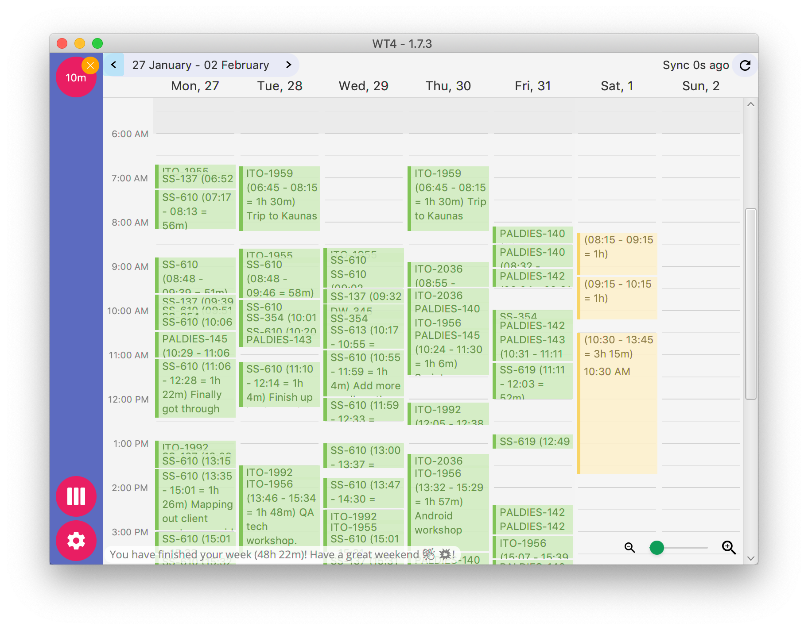

# WT4

Dedicated worklog management for JIRA

* Works offline
* Synchronization with JIRA
* Dynamic log editing
* Works on Windows, Linux and Mac
* Supports Basic authorization (username / pass) + OAuth2

* Wiki how to use the tool - https://github.com/marius-m/wt4/wiki

## Downloads

Builds for `1.7.3` (Latest stable)

* [Build for MacOS](http://738649.s.dedikuoti.lt/public/wt4/WT4-1.7.3.dmg)
* [Build for Windows](http://738649.s.dedikuoti.lt/public/wt4/WT4-1.7.3.exe)
* [Build Linux Debian](http://738649.s.dedikuoti.lt/public/wt4/wt4-1.7.3.deb)

- Archived builds: http://738649.s.dedikuoti.lt/public/wt4/
- Tips how to [set-up to JIRA](https://github.com/marius-m/wt4/wiki/Set-up-Basic)
- Having trouble installing ? Tips on how to install on [MacOS](https://github.com/marius-m/wt4/wiki/Install-Mac) or [Windows](https://github.com/marius-m/wt4/wiki/Install-Win)
  
## Downloads iTo
Some people from my company [iTo](https://www.ito.lt/) are using this tool as well, so we use specially baked app with OAuth connection. 

Builds for `1.7.3` (Latest stable)

* [iTo Build for MacOS](http://738649.s.dedikuoti.lt/public/wt4/ito/WT4-1.7.3.dmg)
* [iTo Build for Windows](http://738649.s.dedikuoti.lt/public/wt4/ito/WT4-1.7.3.exe)
* Linux - Sorry, no users for linux at the moment (yeah, i know - sad :( )

- Archived builds - http://738649.s.dedikuoti.lt/public/wt4/ito/
- How to [set-up to JIRA](https://github.com/marius-m/wt4/wiki/Set-up-OAuth)
- Having trouble installing ? Tips on how to install on [MacOS](https://github.com/marius-m/wt4/wiki/Install-Mac) or [Windows](https://github.com/marius-m/wt4/wiki/Install-Win)

## Early-access experimental builds
There are experimental early access builds for testing. New upcoming things, though might not be too stable, use it at your own risk!

- [MacOS - Basic (1.7.5)](http://738649.s.dedikuoti.lt/public/wt4/eap/WT4-1.7.5.dmg)
- [MacOS - iTo (1.7.5)](http://738649.s.dedikuoti.lt/public/wt4/ito/eap/WT4-1.7.5.dmg)
- [Windows - Basic (1.7.0)](http://738649.s.dedikuoti.lt/public/wt4/eap/WT4-1.7.0.exe)
- [Windows - iTo (1.7.0)](http://738649.s.dedikuoti.lt/public/wt4/ito/eap/WT4-1.7.0.exe)

## Issues

Track issues / feature requests - https://github.com/marius-m/wt4/issues

## Attributions

This app serves me as a sandbox for trying out various java stuff that I find interesting. As a side effect app was born that is being used for easier time tracking. 
Feel free copying / contributing / using code for your own pleasure. 

* [CalendarFX](https://github.com/dlemmermann/CalendarFX) - Most amazing calendar that lets display logs and modify them. Very very cool.
* [JFoenix](http://www.jfoenix.com/) - Material designs for JavaFX! Amazing!
* [Kotlin](https://kotlinlang.org/) - Most of the app is converted to kotlin, once got used to it, never want to look back. 
* [RXJava](https://github.com/ReactiveX/RxJava) Very cool programming [paradigm](http://reactivex.io/)
* [Dagger2](https://github.com/google/dagger) - Essential for making object graph. Loved it every bit.
* [JavaFX](http://docs.oracle.com/javase/8/javase-clienttechnologies.htm) - Great components and quite easy to assemble with after burner.
* [Google material design](https://design.google.com/icons/) - Icons for easier use and clear purpose!
* [jOOQ](https://www.jooq.org/)
* [TornadoFX]() - Lightweight UI framework for JavaFX
* [Java8](http://www.oracle.com/technetwork/java/javase/overview/java8-2100321.html)

## Changelog

Version changelog can be found here - https://github.com/marius-m/wt4/blob/master/CHANGELOG.md
