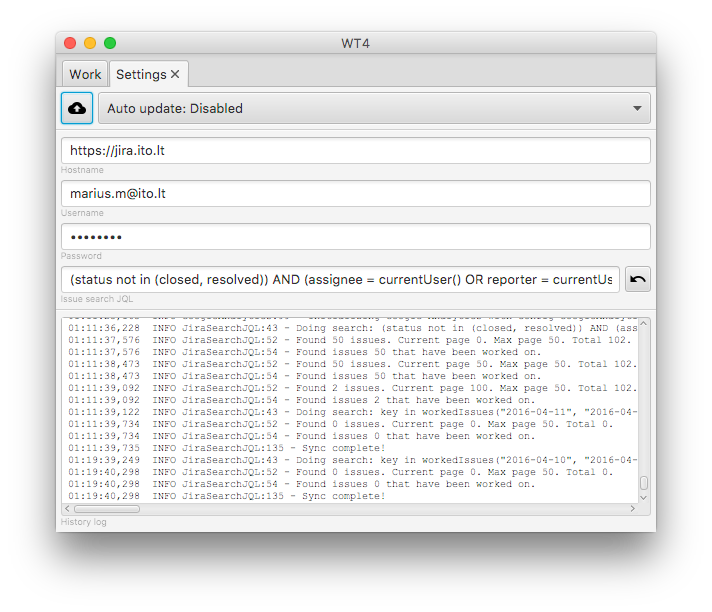

# WT4

Work tracker for JIRA

App is designed for sole purpose - help you track/log worked issues

* Work offline
* Synchronize whenever comfortable
* Easy issue search
* Day/week overview
* Works on evey major platform

## Download

App is built for various platform. There are a **small** and **fat** versions. 

If you have java8 you can try out **small version** (15-20mb). If you're not sure what i'm talking about, install **fat version** and don't concern yourself :)

* MacOSX: 
  - [Small installer](https://dl.dropboxusercontent.com/u/60630588/macosx/WT4-4.0.dmg)
  - [Fat installer](https://dl.dropboxusercontent.com/u/60630588/macosx/WT4-fat-4.0.dmg)
* Windows:
  - [Small zip](https://dl.dropboxusercontent.com/u/60630588/win/WT4.zip)
  - [Small installer](https://dl.dropboxusercontent.com/u/60630588/win/WT4-4.0.exe)
  - [Fat zip](https://dl.dropboxusercontent.com/u/60630588/win/WT4_fat.zip)
  - [Fat installer](https://dl.dropboxusercontent.com/u/60630588/win/WT4-4.0_fat.exe)
* Linux:
  - [Small package installer](https://dl.dropboxusercontent.com/u/60630588/linux/wt4-4.0.deb)
  - [Fat package installer](https://dl.dropboxusercontent.com/u/60630588/linux/wt4-4.0_fat.deb)

App will automatically update to newest version

## Issues

Track issues / feature requests [here](https://github.com/marius-m/wt4/issues)

## Attributions

This app serves me as a sandbox for trying out various java stuff that I find interesting. 
As a side effect app was born that is being used for easier time tracking. 
Feel free copying / contributing / using code for your own pleasure. 

Tricks that were being tackled in this project: 

* [Kotlin](https://kotlinlang.org/) - Most of the app is converted to kotlin, once got used to it, never want to look back. 
* [RXJava](https://github.com/ReactiveX/RxJava) Very cool programming [paradigm](http://reactivex.io/)
* [Dagger2](https://github.com/google/dagger) - Essential for making object graph. Loved it every bit.
* [Getdown](https://github.com/threerings/getdown) - Automatic updater for java. The one that really bahaved as intended, love it so much. 
* [JavaFX-Gradle-Plugin](https://github.com/FibreFoX/javafx-gradle-plugin) - A bit more advanced version of java bundling for platforms.
* [JavaFX](http://docs.oracle.com/javase/8/javase-clienttechnologies.htm) - Great components and quite easy to assemble with after burner.
* [Afterburner](https://github.com/AdamBien/afterburner.fx) - When got into it, cant imagine JavaFx without it.
* [Google material design](https://design.google.com/icons/) - Icons for easier use and clear purpose!
* [JFXTras](https://github.com/JFXtras/jfxtras) - neat components for easier use
  - Agenda view
* [FXExperiende](http://fxexperience.com/) - Advanced components for the jfx
  - Auto completion text view
* [Java8](http://www.oracle.com/technetwork/java/javase/overview/java8-2100321.html)

## How to use it

Overview of the main app features

### Main

* Press "Clokc" to start working. Whenever finished press enter to log time. 
* Search on active issues at the top ([will need to setup first!](#.settings))
* Bubbles will indicate the sync with remote state
	* Yellow - log stored locally
	* Green - log synchronized with remote
	* Red - log had problems synchronizing (double click for details)

### Settings

* Enter credentials and personal preferences
* You can use custom "JQL" for the issue search

### Update

Logs can be updated by pressing the right mouse button on the target log

### Week view / Day view

## FAQ

* Q: Why does it weight so much ?
* A: It is bundled with Java8, so for most part its java that weights so much. It is done, so you don't have to download it separately. 
* Q: I have problems synchronizing with the remote server!
* A: Try checking settings window, as most of the stuff that is done in the background are printed out. That might give you an idea when might not be working.

## Changelog

### 0.9.9.8-EAP

- Update how enter button scales when resizing the window
- Proper size for search result when looking for an issue
- Smarter query for searching issues
- Open issues from search bar to external browser
- Provide parent info if issue is a subtask

### 0.9.9.7

- Configuration sets (can be found in setting, will update documentation how to use)
 - Add configurations to change instance to more than one JIRA
- Graphs (Graph representation on worked issues. Can be opened by pressing on 'Total worked time button')
- Move enter button to top bar for cleaner interface

### 0.9.9.6

- Change remote auto updates url

### 0.9.9.5

- Improved issue search (should work properly now)
- Added issue search in update

### 0.9.9.4

* Refactored all synchronization with remote
* Rewritten most of the core functionality 
  - GA tracking
  - Auto syncrhonization
  - Issue search module
  - Renewed networking
  - Changed to easier bundling
  - Rewritten all bundle scripts
  - Changed app upgrade functionality
	
