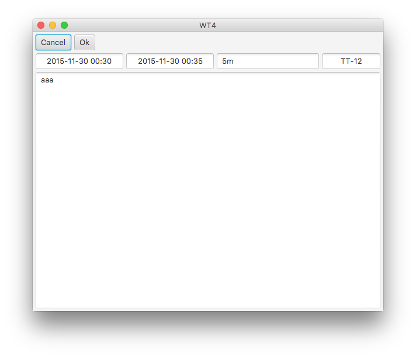

# WT4

Main idea is to speed up time tracking and logging work with ease and it should work indenpendently of the platform. 

The project is still in development, but main features are already completely/partially done. 

* Time tracking
* Create/update/delete work locally
* Basic JIRA integration (upload local work, merge worklog from remote).
* Bundling to all major platforms - OSX, Windows, Linux

## Download

All downloads are in public folder. You should use the latest version that is available for best compatibility. 

* https://www.dropbox.com/sh/k7xvmljd2mkmn9b/AAAIJr-YzUm1t9izYlv1a7CZa?dl=0

## Issues

Please log all the feature and issue request in 

* https://bitbucket.org/mmerkevicius/wt4/issues?status=new&status=open

## How to use it

In theory app should be self explanatory, in practice this is not always the case. So here it is:

* Button "Clock" toggles timer
* Button "Enter" adds a new log
* Field "Comment" is the comment for the task
* Field "Task" is the task ID that connects worklogs to remote. For ex.: ITO-182, TT-122, AD-22.

* By right clicking you can edit / delete a log
* Double click moves to update window
* Bubbles indicate the state log is in
	* Yellow - locally stored log
	* Green - synced with remote
	* Red - error syncing with remote

* Everything can be edited in update window

* Settings tab lets Sync everything to remote server. It needs proper user credentials and remote server hostname. 
* Sync is done on a day that is currently selected
* After correct information, "Refresh" button will try to sync everything with the app. It will:
	* Try to push all the local work logs to the remote
	* Pull all the work logs from remote and display it

## Shortcomings (critical soon to be features for 1.0 version)

* Still there is an original JIRA API restriction of reflecting the changes on remote when trying to edit/delete a task that has been already uploaded. Need to extend API with additional functionality.
* No search autocomplete for task.
* (Still) No autoupdate
* Only currently active day is synchronized 
* Bundling without JRE

## FAQ

* Q: Why does it weight so much ?
* A: It is bundled with Java8, so for most part its java that weights so much. It is done, so you don't have to download it separately. 
* Q: I have java, why I have to download a file this big? 
* A: Project is still in development, smaller size downloads will come in due time.

	
 

